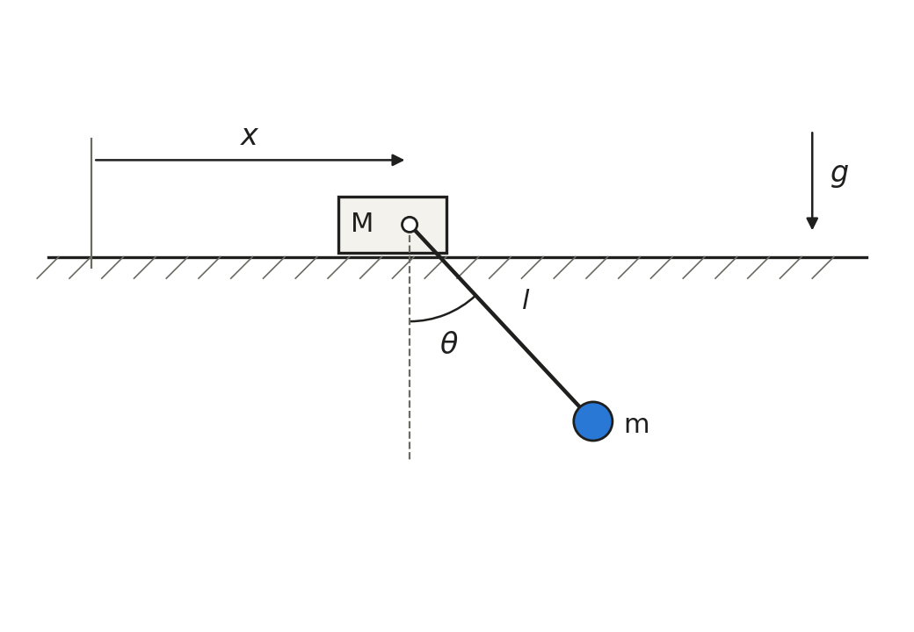

# Cart-pole with a light cart

This repository holds a benchmark problem proposed for the
[Library of Computational Benchmark Problems](https://www.iftomm-multibody.org/benchmark)
of the IFToMM Technical Committee for Multibody Dynamics.



A cart of mass M = 10⁻⁶ kg slides without friction along a horizontal track. A
massless pole of length 1 m, pinned to the cart, carries a 1 kg point mass. The
pole starts horizontal and at rest, and the system is simulated for 10 s.

Because the cart is so light, the mass matrix becomes nearly singular every time
the pole passes through the vertical: its determinant falls by a factor of 10⁶.
At each of the 11 vertical crossings, |θ̇| peaks at 4,429 rad/s. The peak's
full width at half maximum is 1.08 µs, but the tails are long: 10 µs away it is
still about 477 rad/s. The swing itself has a period of 1.8 s.

As scored, the problem tests step-size control. Every SciPy ODE solver, run at
its default tolerances, reports success on this problem, yet their errors range
from about 0.09 to 3.8 against an acceptance threshold of 10⁻⁶.

The near-singular mass matrix also limits a general linear solve to about 10⁻⁹
accuracy. That is well inside the threshold, so it is reported but not scored.

The full problem statement is in [`light_cartpole.pdf`](light_cartpole.pdf). It
gives the parameters, the error definition, the acceptance threshold
(e ≤ 10⁻⁶) and the results-file format.

## Reference solution

[`results.txt`](results.txt) samples the trajectory every 0.01 s from 0 to 10 s
(1001 rows). Its columns are t, x, θ, ẋ, θ̇ and E − E₀.

- **How it was produced:** the equations of motion were derived by hand, and
  their 2×2 system was solved in closed form. The result was integrated with
  DOP853 (SciPy) at rtol 10⁻¹³, atol 10⁻¹⁵. No multibody package was involved.
- **How it was checked:** conservation of momentum and energy reduces the motion
  to a quadrature. That was evaluated in 30-digit arithmetic with mpmath, giving
  an independent solution with no time integration.
- **Agreement:** the benchmark error between the two solutions is e = 9.1×10⁻¹².
  The crossing times agree to within 2×10⁻¹² s.
- **Convergence:** [`convergence.txt`](convergence.txt) lists the tolerance
  ladder for DOP853 and Radau. It also includes a run that computes the
  accelerations with a general linear solve, which stops improving at about
  3×10⁻⁹.

## Reproducing

```bash
pip install numpy scipy matplotlib mpmath
python generate_reference.py
pdflatex light_cartpole.tex && pdflatex light_cartpole.tex
```

The script takes about two minutes, most of it the Radau runs. It rewrites
`results.txt`, `convergence.txt`, the LaTeX fragments (`convergence.tex`,
`values.tex`) and every figure. The published files were generated with Python
3.14, NumPy 2.3.5, SciPy 1.16.3, Matplotlib 3.10.7 and mpmath 1.3.0. CPU times
in `convergence.txt` depend on the machine; the errors do not.

## Author

Noah Parsons · parsons.m.noah@gmail.com · ORCID
[0009-0000-7224-6040](https://orcid.org/0009-0000-7224-6040)

Code is released under the MIT License (see `LICENSE`).
